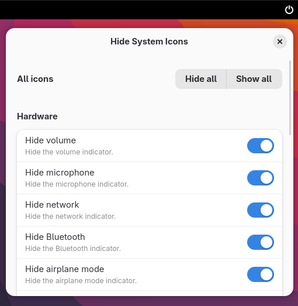

# Hide System Icons (GNOME Extension)

Hide specific system icons from the GNOME Quick Settings panel.



## Install

Install from GNOME Extensions: [Hide System Icons](https://extensions.gnome.org/extension/8558/hide-system-icons/)

## Compatibility

- Modern (ESM): GNOME Shell 45–50
- Legacy (legacy loader): GNOME Shell 40–44

## Features

- Sound: hide volume, hide microphone
- Privacy: hide camera, hide location, hide screen sharing
- Connectivity: hide network, hide Bluetooth, hide airplane mode, hide Thunderbolt
- Display: hide brightness, hide keyboard backlight, hide night light, hide dark mode, hide auto rotate
- Power: hide power, hide power profiles
- Status: hide Do Not Disturb (GNOME 49+), hide background apps
- Changes apply immediately and persist across restarts

## Settings

Preferences: Extensions app → this extension → Preferences. Toggles are grouped to match the Quick Settings panel:

- Sound: hide volume, hide microphone
- Privacy: hide camera, hide location, hide screen sharing
- Connectivity: hide network, hide Bluetooth, hide airplane mode, hide Thunderbolt
- Display: hide brightness, hide keyboard backlight, hide night light, hide dark mode, hide auto rotate
- Power: hide power, hide power profiles
- Status: hide Do Not Disturb (GNOME 49+), hide background apps

GSettings (advanced):

- Schema: `org.gnome.shell.extensions.hide-system-icons`
- Keys:
  - `hide-volume` (boolean)
  - `hide-microphone` (boolean)
  - `hide-camera` (boolean)
  - `hide-location` (boolean)
  - `hide-remote-access` (boolean)
  - `hide-network` (boolean)
  - `hide-bluetooth` (boolean)
  - `hide-rfkill` (boolean)
  - `hide-thunderbolt` (boolean)
  - `hide-brightness` (boolean)
  - `hide-backlight` (boolean)
  - `hide-night-light` (boolean)
  - `hide-dark-mode` (boolean)
  - `hide-auto-rotate` (boolean)
  - `hide-power` (boolean)
  - `hide-power-profiles` (boolean)
  - `hide-do-not-disturb` (boolean)
  - `hide-background-apps` (boolean)

## Manual installation (from source)

Prerequisites:

- make, zip, glib-compile-schemas
- Node.js and npm

```bash
npm install

# Build both modern (45–50) and legacy (40–44) packages
make pack

# Or build individually
make pack-modern
make pack-legacy

# Install the modern build (45–50) to ~/.local/share/gnome-shell/extensions
make install-modern

# Install the legacy build (40–44) to ~/.local/share/gnome-shell/extensions
make install-legacy
```

## License

MIT — see `LICENSE`.

