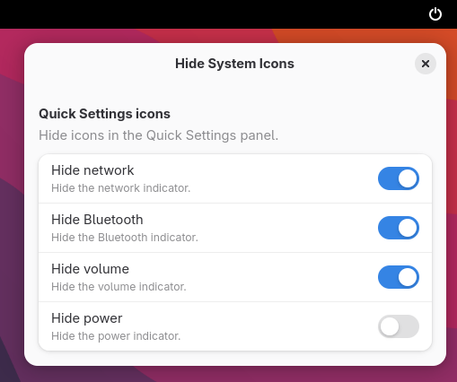

# Hide System Icons (GNOME Extension)

Hide specific system icons from the GNOME Quick Settings panel.



## Install

Install from GNOME Extensions: [Hide System Icons](https://extensions.gnome.org/extension/8558/hide-system-icons/)

## Compatibility

 - Modern (ESM): GNOME Shell 45–49
 - Legacy (legacy loader): GNOME Shell 40–44

## Features

- Hide network icon
- Hide volume icon
- Hide power icon
- Hide Bluetooth icon
- Changes apply immediately and persist across restarts

## Settings

Preferences: Extensions app → this extension → Preferences. Available toggles:
- Hide volume icon
- Hide network icon
- Hide power icon
- Hide Bluetooth icon

GSettings (advanced):
- Schema: `org.gnome.shell.extensions.hide-system-icons`
- Keys:
  - `hide-volume` (boolean)
  - `hide-network` (boolean)
  - `hide-power` (boolean)
  - `hide-bluetooth` (boolean)

## Manual installation (from source)

Prerequisites:
- make, zip, glib-compile-schemas
- Node.js and npm

```bash
npm install

# Build both modern (45–49) and legacy (40–44) packages
make pack

# Or build individually
make pack-modern
make pack-legacy

# Install the modern build (45–49) to ~/.local/share/gnome-shell/extensions
make install-modern

# Install the legacy build (40–44) to ~/.local/share/gnome-shell/extensions
make install-legacy
```

## License

MIT — see `LICENSE`.